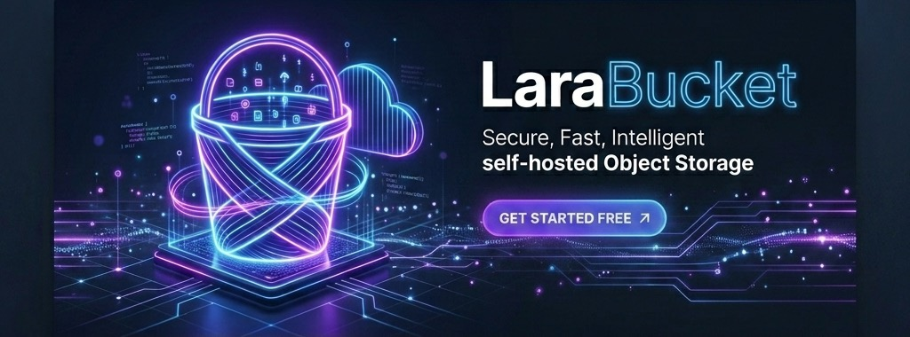

<p align="center">
  
</p>

<p align="center">
  <a href="https://packagist.org/packages/larabucket/laravel"></a>
  <a href="https://packagist.org/packages/larabucket/laravel"></a>
  <a href="https://github.com/rakshitbharat/laravel-bucket/actions/workflows/tests.yml"></a>
  <a href="LICENSE.md"></a>
  <a href="https://php.net"></a>
  <a href="https://laravel.com"></a>
</p>

---

## 🌟 What is LaraBucket?

**LaraBucket** is a self-hosted, lightweight object storage solution designed to decouple file storage from application servers. 

Rather than deploying complex, expensive AWS S3 clusters or polluting your web server with user uploads, LaraBucket acts as a central storage authority. This package serves two functions out-of-the-box:

*   **⚡ Client Disk Adapter**: A custom Flysystem V3 driver (`larabucket`) that integrates directly with Laravel's native `Storage` facade. It serves as a seamless, drop-in replacement for S3 or local storage drivers.
*   **🖥️ Storage Server Engine**: Standard REST API controllers, database migrations, and authentication middleware that turn any simple, low-cost Laravel application into a robust storage host.

---

## ✨ Features

- **Stateless Client Servers**: Spin up, destroy, or scale your client apps without risking data loss.
- **Shared Hosting Friendly**: Fully runs on standard Shared Hosting PHP and SQLite/MySQL (no Root access or complex S3 setups required).
- **Secure Sandbox**: Full path sanitization and directory traversal prevention (`../`) keep bucket storage completely isolated.
- **Real-Time Quota Tracking**: Tracks storage usage (in bytes) and enforces configurable MB quotas per bucket.
- **GitHub CI/CD Out of the Box**: Pre-configured Github workflows to test package against multiple PHP & Laravel versions and auto-publish to Packagist.

---

## 📦 Client-Side Setup (Connect Your App)

### 1. Installation
Install the package in your client Laravel application:
```bash
composer require larabucket/laravel
```

### 2. Register Disk
Add the custom `larabucket` driver configuration to your `config/filesystems.php`:
```php
'disks' => [
    // ...
    'larabucket' => [
        'driver'  => 'larabucket',
        'api_url' => env('LARABUCKET_API_URL'),
        'bucket'  => env('LARABUCKET_BUCKET'),
        'secret'  => env('LARABUCKET_SECRET'),
    ],
],
```

### 3. Configure Credentials
Add these keys to your client `.env` file:
```dotenv
# Your self-hosted LaraBucket server API endpoint
LARABUCKET_API_URL=https://storage.yourdomain.com/api

# Credentials generated in the host admin panel
LARABUCKET_BUCKET=ecommerce-assets
LARABUCKET_SECRET=sk_live_generated_secret_key_123

# Set as default disk (optional)
FILESYSTEM_DISK=larabucket
```

### 4. Developer Usage
Use Laravel's native `Storage` facade exactly as you would with local or S3 drivers:

```php
use Illuminate\Support\Facades\Storage;

// Store a file
Storage::disk('larabucket')->put('avatars/user_1.jpg', $fileContents);

// Retrieve file existence
if (Storage::disk('larabucket')->exists('avatars/user_1.jpg')) {
    // Generate public file URL
    $url = Storage::disk('larabucket')->url('avatars/user_1.jpg');
}

// Delete file
Storage::disk('larabucket')->delete('avatars/user_1.jpg');
```

---

## 🖥️ Server-Side Setup (Self-Host LaraBucket)

### 1. Installation
Install the package in your host Laravel application:
```bash
composer require larabucket/laravel
```

### 2. Configure Environment
Add the following to your host `.env`:
```dotenv
# Enable host API endpoints
LARABUCKET_SERVER_ENABLED=true

# Local or S3 disk where host saves the actual files
LARABUCKET_SERVER_DISK=public

# Admin dashboard access credentials
LARABUCKET_ADMIN_EMAIL=admin@yourstorage.com
LARABUCKET_ADMIN_PASSWORD=my_secure_admin_password

# Public URL of the storage server
LARABUCKET_SERVER_URL=https://storage.yourdomain.com
```

### 3. Publish Configuration & Migrations
```bash
php artisan vendor:publish --tag=larabucket-config
php artisan vendor:publish --tag=larabucket-migrations
```

### 4. Run Migrations & Expose Files
Run the database migrations and symlink the storage folder:
```bash
php artisan migrate
php artisan storage:link
```

### ☁️ Quick Standalone Server Deployment (Shared Hosting & Out-of-the-Box Setup)

LaraBucket provides a pre-packaged, zero-dependency standalone server. This allows you to deploy and start your storage server on any standard shared hosting environment (e.g. cPanel, Hostinger, Plesk) or local environment in under 5 minutes:

1. **📥 Download Standalone ZIP**: [Download larabucket-standalone-server.zip directly from this repository](https://github.com/rakshitbharat/laravel-bucket/raw/main/larabucket-standalone-server.zip).
   - This ZIP includes the full Laravel core framework, pre-installed dependencies (no need to run `composer install`), a ready-to-use MySQL database dump (`database/database.sql`), and optimized `.htaccess` routing.
2. **Setup Instructions**: Follow the detailed, step-by-step [Shared Hosting Deployment Guide](docs/SHARED_HOSTING.md) to extract, configure `.env`, and launch your console.

---

## 🖥️ Using the Admin Control Panel

LaraBucket comes with a built-in, premium dashboard console. Once set up, visit:
`https://storage.yourdomain.com/admin/larabucket`

For a full step-by-step feature walkthrough, see the official [Admin Control Panel Guide](docs/USER_GUIDE.md).

### Quick Walkthrough:
1. **🔐 Log In**: Use the admin email and password configured in your `.env` file (`LARABUCKET_ADMIN_EMAIL`/`LARABUCKET_ADMIN_PASSWORD`).
2. **🪣 Create Storage Bucket (Namespace)**: Click **"Create Bucket"** in the top-right corner. Give it a name (e.g. `marketing-assets`) and set a storage limit in MB.
3. **🔌 Connect Your Client**: Click **"Connect"** on the bucket to view the auto-generated API credentials and custom environment variables to copy-paste into your client app's `.env`.
4. **📁 Manage Files & Folders**: Click **"Browse"** on any bucket to open the stateful File Explorer:
   - Double-click folders to enter them, and click the breadcrumbs to navigate back.
   - Drag & drop files or click **"Upload"** to upload files.
   - Click files to copy their public serving URL or delete them.

---

## 🧪 Local Testing

The package includes a comprehensive PHPUnit test suite (29 tests, 119 assertions) covering both the client adapter and server API.

Run the test suite in an isolated environment using Docker:
```bash
# 1. Build test runner
docker-compose build

# 2. Install dependencies
docker-compose run --rm test-runner composer install --no-security-blocking

# 3. Run test suite
docker-compose run --rm test-runner vendor/bin/phpunit
```

---

## 🚀 DevOps & CI/CD Automation

This repository includes pre-configured **GitHub Actions** under `.github/workflows/`:
1.  **`tests.yml`**: Triggers on pushes and PRs to verify functionality across PHP (`8.1`, `8.2`, `8.3`) and Laravel (`10.*`, `11.*`) matrices.
2.  **`release.yml`**: Auto-publishes and syncs new releases to Packagist when a version tag (`v*`) is pushed.

*To enable Packagist auto-publishing, add your Packagist credentials to your GitHub repository secrets as `PACKAGIST_USERNAME` and `PACKAGIST_API_TOKEN`.*

---

## 📄 License

The MIT License (MIT). Please see [LICENSE.md](LICENSE.md) for more information.
